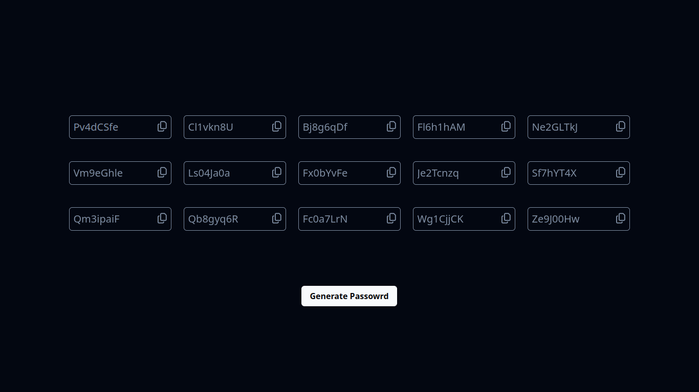

### MemoraPass: Easily Memorable Password Generator (Work in Progress...)

# MemoraPass


## About the App

MemoraPass is a user-friendly password generator designed to help you create easily memorable and secure passwords. While it's still a work in progress, it already offers essential features that simplify the process of generating and choosing memorable passwords.

## Features

- **Memorable Passwords:** Generate passwords that are easy to remember, making it more convenient to access your accounts.

- **Batch Password Generation:** Create multiple passwords at once, allowing you to choose the one that suits your needs best.

## Preview of the app



## Getting Started

Follow these steps to get started with MemoraPass:

1. Clone the repository to your local machine:

```shell
git clone https://github.com/abderrahimSabrou/MemoraPass.git

```

2. Run the app by opening `homePage.html` file
